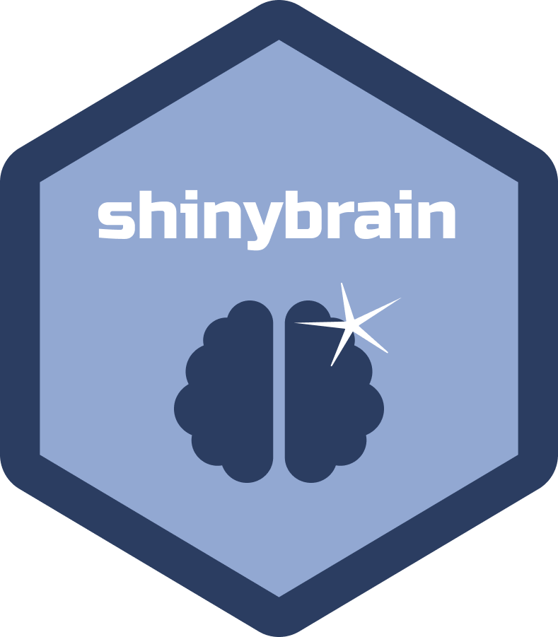

</img>
# shinybrain

<!-- badges: start -->

<!-- badges: end -->

Ever since the [shiny](https://shiny.rstudio.com) package emerged in the R community, we have seen many terrific applications shared throughout many industries and the overall R community. It is always inspiring when you see an amazing application, often wanting to learn more about the author's development approach to the final product. Imagine a way we could not only see that polished final version, but the actual stages of development from a simple prototype to a robust application ready for production? This is where `{shinybrain}` can help!

The goal of `{shinybrain}` is to provide a simple procedure to create multiple snapshots of an overall Shiny application built upon the excellent [`{brochure}`](https://github.com/ColinFay/brochure) package authored by [Colin Fay](https://github.com/ColinFay), where you can bundle these snapshots as individual Shiny applications inside a single overall application. 

TODO: Add animated GIF of shinysaurus example

## Basic Usage

To get started, you can simply create a template application powered by `{shinybrain}`:

```r
library(shinybrain)
add_shinybrain("my_brain_app")
```

If you are using the [RStudio](https://rstudio.com) IDE, a new project is automatically created for the template application. Once you have the application structure created, it is easy to run the application in the default template. A `{shinybrain}` application contains the typical `app.R` which can easily be run inside your preferred development environment, such as RStudio or Visual Studio Code. In addition, you can run an application with the convenient `brainpower()` function:

```r
brainpower("path/to/my_brain_app")
```

The default `{shinybrain}` template provides a single Shiny application (referred as a _page_) with placeholders of output, and an introduction page with rendered markdown. To show a next stage of an application's development progression, you can create a new _page_ with the `snapshot_shinybrain()` function:

```r
snapshot_shinybrain("path/to/my_brain_app")
```

There is no limit to how many snapshots your `{shinybrain}` application can have. The default behavior is to create a new snapshot from the last available snapshot, but you can create a snapshot from a specific one by setting `use_current_snapshot = FALSE` and giving the name of the desired snapshot with the `snapshot_name` parameter. If you want to simply view the contents of a single snapshot without having to run the entire set, you can use the `brainsnap()` function:

```r
brain_snap("page1", path = "path/to/my_brain_app")
```

Deploying a `{shinybrain}` application is no different than a typical Shiny application, since the overall structure is self-contained with the root of the app directory containing `app.R`.

TODO: Add a directory tree listing of an example app folder

## Feedback

The `{shinylearning}` package was directly inspired by the R community, and I welcome all feedback to make this package better. If you have a specific bug report or request for a new feature, please file a new issue. If you have a more general topic you would like to discuss, please create a new post on the [Discussions](https://github.com/rpodcast/shinybrain/discussions) board.

## Contributions

TODO: Add a contributing guide markdown file
## Installation

You can install the development version of shinybrain from
[GitHub](https://github.com/) with:

``` r
# install.packages("remotes")
remotes::install_github("rpodcast/shinybrain")
```

## Code of Conduct
  
Please note that the shinybrain project is released with a [Contributor Code of Conduct](https://contributor-covenant.org/version/2/0/CODE_OF_CONDUCT.html). By contributing to this project, you agree to abide by its terms.
